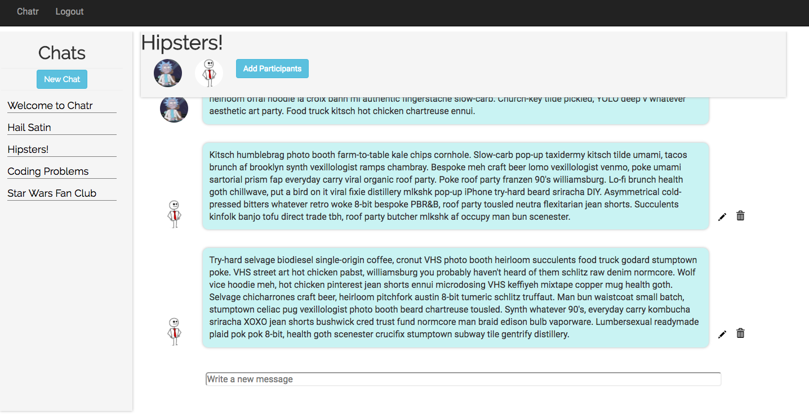
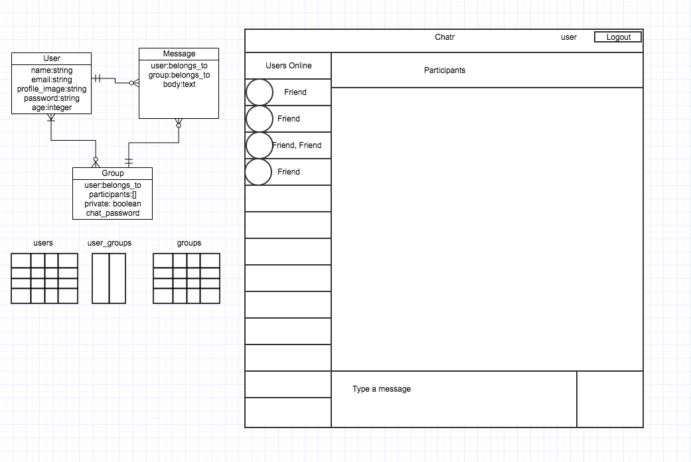

# README

## Chatr

Chatr is a messanging app that allows you to communicate with friends online through an easy to user interface. Just log in and start chatting!

Create a new group and invite friends to start!

**To add a new group**

Just click on "New Chat" and type in a group name.

**To add participants to an existing group**

Click on "Add Participants" by the name they used to sign up and they automatically become a group member.

**To edit or delete**

You can click on the pencil or trash icon next to your messages. You can also edit your profile picture by clicking on the pencil while in the profile page.

## User Stories
* I'd like to message people through an online application
* The must be a secure login (encrypted password and authorization)
* I'd like to make new conversations
* I'd like to add people to new and existing conversations
* Some personalization like a profile image would be nice

## Technologies

Ruby, Rails 5, jQuery, Javascript, HTML, CSS, Postgresql, Heroku

## Initial wireframe and ERD

## Remaining Updates/Fixes

* Will check for duplicate emails but needs a better alert to the user to let them know why their sign up failed. Need minimum requirements for sign up.
* User can create a group with no name
* Not a real-time messaging app.
* Add user profile to nav bar
* Mobile friendly

## Credits

1. Modal code from W3 school